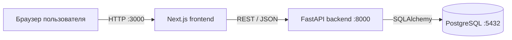
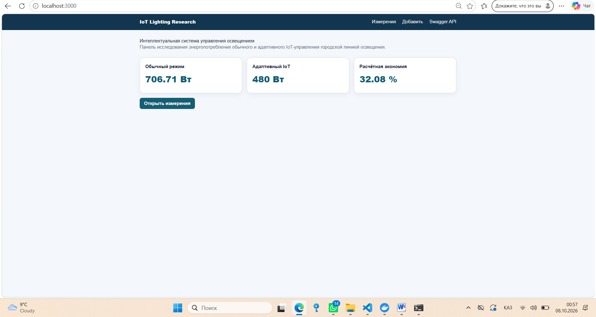
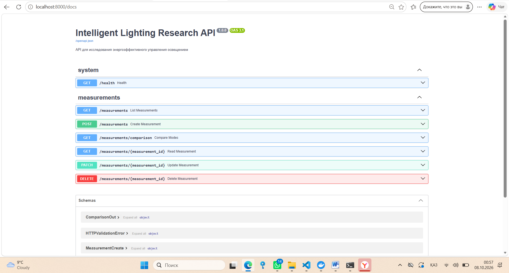
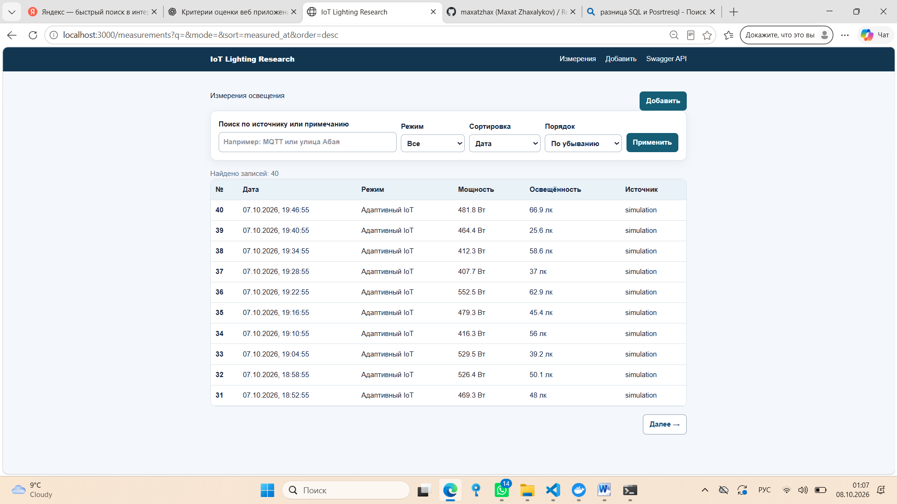

# Intelligent Lighting Research Web Application

[](https://github.com/Dinara-Zhukenova/research-web-app-methodology/actions/workflows/backend.yml)
[](https://github.com/Dinara-Zhukenova/research-web-app-methodology/actions/workflows/frontend.yml)

Веб-приложение для исследования энергопотребления обычного и адаптивного IoT-управления городской системой освещения.

## Связь с диссертацией

Проект создан по теме исследования: «Исследование и разработка энергоэффективной интеллектуальной системы управления освещением городских улиц и зданий на основе технологии IoT». Главная сущность — измерение электрических и светотехнических параметров. Приложение позволяет сравнивать мощность в режимах «таймер/фотореле» и «адаптивный IoT».

## Возможности

- список измерений с пагинацией;
- поиск по источнику данных и примечанию;
- фильтр по режиму, сортировка по дате, мощности, освещённости и напряжению;
- просмотр карточки записи;
- создание, редактирование и удаление;
- проверка входных данных и корректные ошибки 404/422;
- расчёт средней мощности и процента экономии;
- Swagger/OpenAPI;
- 10 backend-тестов;
- 40 осмысленных начальных наблюдений;
- запуск одной командой через Docker Compose.

## Архитектура



| Компонент | Технология | Назначение |
|---|---|---|
| Frontend | Next.js 16, React 19, TypeScript | Интерфейс, формы и страницы |
| Backend | Python 3.12, FastAPI, Pydantic | REST API и проверка данных |
| Доступ к БД | SQLAlchemy 2, Alembic | Модели, запросы и миграции |
| База данных | PostgreSQL 17 | Хранение измерений |
| Инфраструктура | Docker Compose | Единый воспроизводимый запуск |
| CI | GitHub Actions, Dependabot | Тесты, линтер и сборка |

Подробное описание: [docs/architecture.md](docs/architecture.md).

## Быстрый старт

Требуется установленный Docker Desktop.

В PowerShell из корня проекта:

```powershell
Copy-Item .env.example .env
docker compose up --build
```

После запуска:

- интерфейс: http://localhost:3000;
- Swagger API: http://localhost:8000/docs;
- проверка backend: http://localhost:8000/health.

Начальные данные автоматически добавляются при первой загрузке пустой базы.

Остановка без удаления данных:

```powershell
docker compose down
```

Внимание: `docker compose down -v` удаляет том PostgreSQL вместе с данными.

## Локальная разработка без Docker

Backend:

```powershell
cd backend
uv sync
uv run alembic upgrade head
uv run uvicorn app.main:app --reload
```

Frontend в другом терминале:

```powershell
cd frontend
$env:API_URL="http://localhost:8000"
npm install
npm run dev
```

Для локального backend необходим запущенный PostgreSQL и корректный `DATABASE_URL`.

## Тесты и линтеры

```powershell
cd backend
uv sync
uv run ruff check .
uv run pytest -q

cd ..frontend
npm install
npm run lint
npm run build
```

## Структура проекта

```text
research-web-app-methodology/
├── README.md
├── LICENSE
├── CITATION.cff
├── .gitignore
├── .env.example
├── docker-compose.yml
├── docker-compose.prod.yml
├── Caddyfile
├── .github/
│   ├── dependabot.yml
│   └── workflows/
│       ├── backend.yml
│       └── frontend.yml
├── backend/
│   ├── Dockerfile
│   ├── .dockerignore
│   ├── pyproject.toml
│   ├── uv.lock
│   ├── alembic.ini
│   ├── alembic/
│   │   ├── env.py
│   │   └── versions/
│   │       └── 20261008_01_create_measurements.py
│   ├── app/
│   │   ├── __init__.py
│   │   ├── main.py
│   │   ├── db.py
│   │   ├── core/
│   │   │   ├── __init__.py
│   │   │   └── config.py
│   │   └── modules/
│   │       ├── __init__.py
│   │       └── measurements/
│   │           ├── __init__.py
│   │           ├── models.py
│   │           ├── schemas.py
│   │           ├── service.py
│   │           └── router.py
│   ├── scripts/
│   │   └── seed.py
│   └── tests/
│       ├── conftest.py
│       └── test_measurements.py
├── frontend/
│   ├── Dockerfile
│   ├── .dockerignore
│   ├── next.config.ts
│   ├── package.json
│   └── src/
│       ├── app/
│       │   ├── layout.tsx
│       │   ├── page.tsx
│       │   └── measurements/
│       │       ├── actions.ts
│       │       ├── page.tsx
│       │       ├── new/
│       │       │   └── page.tsx
│       │       └── [id]/
│       │           └── page.tsx
│       ├── components/
│       │   └── MeasurementForm.tsx
│       └── lib/
│           ├── api.ts
│           └── types.ts
├── database/
│   └── research.sql
└── docs/
    ├── architecture.md
    ├── compliance.md
    ├── defense.md
    └── screenshots/
        ├── 01-home-page.png
        ├── 02-swagger-api.png
        └── 03-measurements-list.png
```

## Данные

В репозитории нет персональных или закрытых данных. Seed-скрипт создаёт 40 воспроизводимых синтетических наблюдений: 20 для обычного режима и 20 для адаптивного режима. Они предназначены для демонстрации функций приложения, а не для окончательного научного вывода.

## AI assistance

ИИ-ассистент использовался для создания первоначального каркаса, проверки структуры и подготовки документации. Архитектурные решения, соответствие исследовательской задаче, результаты тестирования и окончательная ответственность за код остаются за автором проекта.

## Подготовка к защите

Покажите последовательно:

1. главную страницу и связь с темой исследования;
2. список, поиск, сортировку и пагинацию;
3. создание измерения и ошибку пустой формы;
4. карточку, редактирование и удаление;
5. Swagger `/docs`;
6. файлы `models.py`, `schemas.py`, `service.py`, `router.py`;
7. миграцию Alembic;
8. результат `10 passed`, линтер и GitHub Actions.

## Лицензия и цитирование

Код распространяется по лицензии MIT. Информация для цитирования находится в `CITATION.cff`. Перед публикацией замените `Dinara-Zhukenova/research-web-app-methodology`, имя автора и контакты на собственные данные.

## Скриншоты приложения

### Главная страница



### Документация Swagger API



### Список измерений

