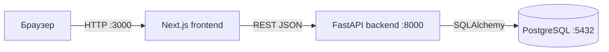
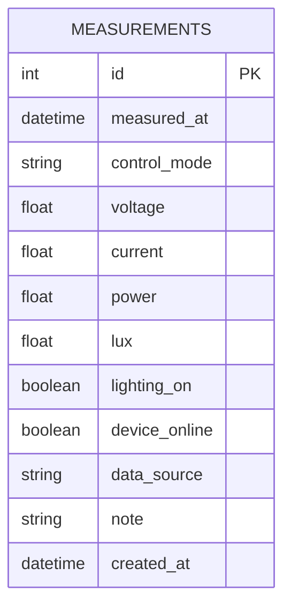

# Архитектура приложения

## Компоненты

## Схема базы данных

## API

| Метод | Путь | Назначение | Коды |
|---|---|---|---|
| GET | `/health` | Проверка backend | 200 |
| GET | `/measurements` | Список, поиск, фильтр, сортировка, пагинация | 200, 422 |
| GET | `/measurements/comparison` | Сравнение режимов | 200 |
| GET | `/measurements/{id}` | Карточка измерения | 200, 404 |
| POST | `/measurements` | Создать измерение | 201, 422 |
| PATCH | `/measurements/{id}` | Изменить измерение | 200, 404, 422 |
| DELETE | `/measurements/{id}` | Удалить измерение | 204, 404 |

## Архитектурные решения

1. FastAPI выбран за автоматическую документацию OpenAPI, строгую валидацию Pydantic и простое тестирование.
2. Модульный монолит сохраняет простоту одного backend, но разделяет модель, схемы, сервис и HTTP-маршруты.
3. PostgreSQL используется как промышленная СУБД, а изменение структуры выполняется только миграциями Alembic.
4. Next.js Server Components и Server Actions не раскрывают внутренний адрес backend браузеру.
5. Docker Compose обеспечивает воспроизводимый запуск всех компонентов одной командой.
